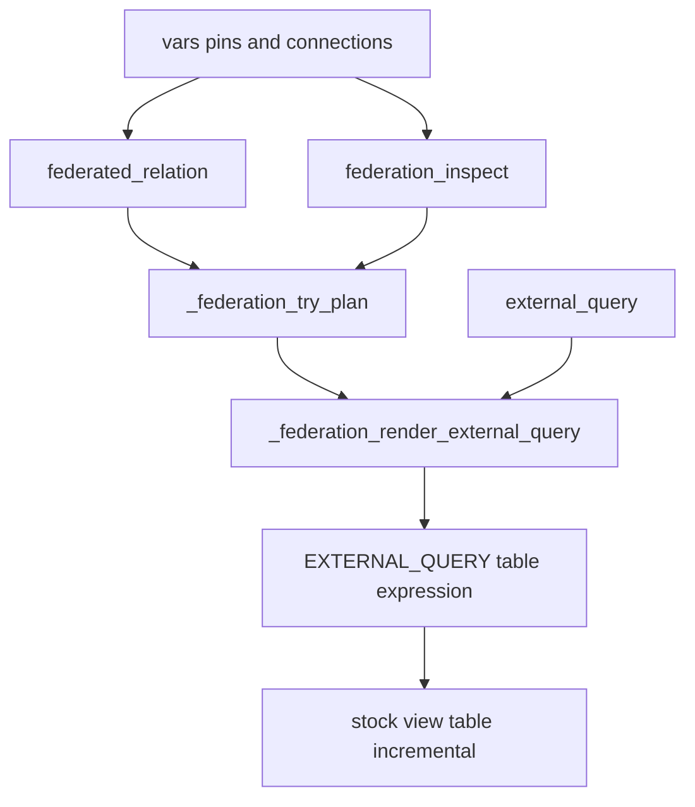
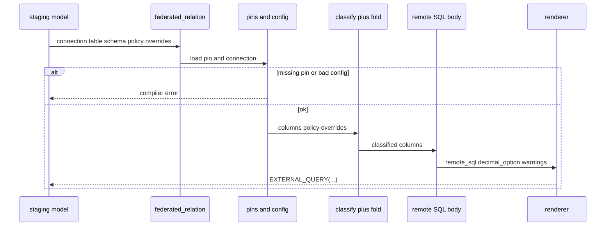
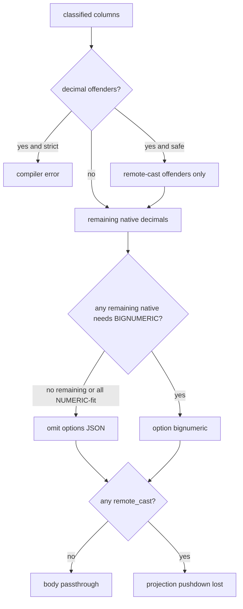
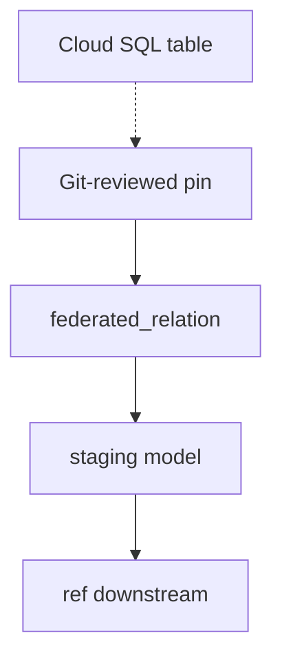

# RFC-0001 Federation Compiler - Plan

## Goal Capsule

- **Objective:** Finish RFC-0001 v0.1 so `dbt_bigquery_federation` is a complete pinned BigQuery `EXTERNAL_QUERY` planner: type-map parity with Google, pin-authoring safety, inspect/error fidelity, materialization examples, and operational docs.
- **Authority:** `docs/rfcs/0001-bigquery-federation-architecture.md` wins on product behavior. This plan wins on remaining implementation mechanism. Do not reopen later-RFC products.
- **Baseline:** Branch `cursor/pinned-federation-compiler-37b8` already ships the planner core (`federated_relation`, `external_query`, `federation_inspect`, pins, decision table, decimal fold, Core 1.10/1.11 CI, non-blocking Fusion). Units below close remaining RFC gaps; they do not rewrite the compiler.
- **Stop:** Stop after RFC §26 acceptance is met and later-RFC items stay out of the tree. Do not add live discovery, `columns=`, MySQL/Spanner, codegen, or GCP E2E.
- **Execution profile:** `code`. Work on the existing PR branch.
- **Tail ownership:** Implementer owns tests, docs, and RFC/README alignment. Abandoned experiments must not remain in the diff.

## Product Contract

### Summary

v0.1 is a pinned federation planner, not a live catalog crawler and not a materialization. Compilation is a pure function of Git plus vars. The primary interface is a table-expression macro that renders `EXTERNAL_QUERY`. Remote `SELECT * FROM T` is preserved when every pinned column is natively safe so BigQuery pushdown can survive.

Product Contract extracted from the RFC. **Product Contract preservation:** unchanged. IDs assigned here.

### Problem Frame

Hand-written `EXTERNAL_QUERY` calls drift from Cloud SQL schemas and mishandle unsupported PostgreSQL types. Live `run_query` at compile time makes the same Git SHA emit different SQL. A custom materialization would own dbt persistence internals. Pins plus a decision-table planner keep compile reviewable and keep stock `view` / `table` / `incremental` as the persist story.

### Requirements

**Public API**

- R1. `federated_relation(connection, table, schema=None, type_policy=None, overrides=None)` returns a BigQuery `EXTERNAL_QUERY` table expression. There is no `columns=` argument.
- R2. `external_query(connection, sql)` renders trusted raw remote SQL through the private renderer and never runs the planner.
- R3. `federation_inspect` plans from pins, prints conversion diagnostics, and errors when `live=true`.
- R4. A missing pin is a compiler error. Parse emits the real planned SQL.

**Pins and planning**

- R5. Pins live at `vars.dbt_bigquery_federation.tables['<connection>.<schema>.<table>'].columns`. No warehouse I/O from `federated_relation`.
- R6. Preserve remote `SELECT * FROM T` when every pinned column is natively safe, or a single query-wide decimal option makes every remaining native decimal safe.
- R7. Emit a remote projection only when a conversion or explicit override requires a source expression. Inspect then reports `pushdown=lost`.
- R8. Override precedence is package defaults, then connection `types.policy`, then `type_overrides` by source type, then pin column strategy fields, then invocation `type_policy` / `overrides`.

**Types**

- R9. Under `safe`, known-unsupported PostgreSQL types remote-cast to `text`. Unknown types fail. Under `strict`, unsupported and unknown types fail until an override acknowledges them.
- R10. Decimal fold: all NUMERIC-fit → passthrough and omit options JSON; all BIGNUMERIC-fit → passthrough plus `bignumeric` option; mixed offenders under `safe` remote-cast only offenders and warn; under `strict` fail offenders. Never stringify a well-typed sibling because an offender exists.
- R11. `json` maps natively to BigQuery `STRING`. `jsonb` is unsupported.

**Safety and packaging**

- R12. Public macros use `adapter.dispatch(..., 'dbt_bigquery_federation')`. Internal helpers are called as `dbt_bigquery_federation._federation_*`. Remote dialect uses an explicit parse-resolvable router, not `adapter.dispatch`.
- R13. v0.1 provider key is `cloud_sql_postgres` only. Connection IDs match `projects/.../locations/.../connections/...`.
- R14. Identifiers are quoted through the provider quoter. High-level APIs never concatenate consumer SQL fragments. `external_query` is documented as executing the dbt identity's string on the remote database.
- R15. The package does not set `on_schema_change`. Incremental examples use `on_schema_change='fail'` unless the consumer chooses otherwise.

**Verification**

- R16. Required CI is Core 1.10 and 1.11 on Postgres as the Jinja engine. Fusion is non-blocking. No GCP is required to merge planner work.

### Actors

- A1. Analytics engineer: authors pins, wraps macros in staging models, runs inspect before merge.
- A2. Package maintainer: owns type map, fold, docs, and CI.
- A3. CI: Core planner/parse tests plus compile-only federation smoke.

### Key Flows

- F1. Staging compile
  - **Trigger:** A1 compiles a model that calls `federated_relation`.
  - **Steps:** Load pin → classify columns → fold decimals → choose passthrough or projection → render `EXTERNAL_QUERY` → persist with stock materialization.
  - **Covered by:** R1, R5, R6, R7, R10
- F2. Inspect before merge
  - **Trigger:** A1 runs `federation_inspect` for a pin.
  - **Steps:** Reject `live=true` → plan from pins → log relation/policy/body/decimal/pushdown and per-column rows.
  - **Covered by:** R3
- F3. Hatch
  - **Trigger:** A1 needs SQL the planner will not emit.
  - **Steps:** Resolve connection → private renderer → no planner.
  - **Covered by:** R2

### Acceptance Examples

- AE1. Covers R6. Given an all-native pin, when `federated_relation` compiles, then remote SQL is `select * from "<schema>"."<table>"` with no options JSON.
- AE2. Covers R7, R9. Given `uuid` and `jsonb` under `safe`, when compiled, then remote SQL projects `cast(... as text)` and inspect reports `pushdown=lost`.
- AE3. Covers R10. Given `numeric(12,2)` plus unbounded `numeric` under `safe`, when compiled, then only the unbounded column is remote-cast and a compile warning reports pushdown loss.
- AE4. Covers R3, R4. Given `live=true` or a missing pin, when inspect or `federated_relation` runs, then compilation errors.

### Success Criteria

RFC §26: pinned `cloud_sql_postgres` planning; documented unsupported types; per-type and per-column overrides; precision-aware decimal fold; observable `pushdown=kept|lost`; PostgreSQL identifier quoting; Core 1.10/1.11 CI; Fusion may fail; no warehouse access from `federated_relation`; parse equals compile; stock materializations; canonical connection IDs; no database passwords in package vars; no GCP to merge.

### Scope Boundaries

**In scope (this plan):** remaining v0.1 gaps on the current branch — Google type-map parity, pin-authoring validation, inspect/error fidelity, materialization examples, operational docs, RFC/README alignment.

**Deferred for later (RFC §3 MUST NOT, §25 Later RFCs, and §28):** live discovery; `source()` helper; MySQL; AlloyDB as a tested provider; Spanner; schema diff; codegen; GCP E2E; Fusion BigQuery as a support claim; Plan D post-process.

**Outside this product's identity:** CDC, ingestion service, new dbt adapter, custom `federated` materialization, connection/IAM/credential management, remote DDL/DML.

### Sources

- Origin: `docs/rfcs/0001-bigquery-federation-architecture.md`
- GoogleSQL `EXTERNAL_QUERY` and PostgreSQL type mapping: https://cloud.google.com/bigquery/docs/reference/standard-sql/federated_query_functions
- Federated-query limits and pushdown: https://docs.cloud.google.com/bigquery/docs/federated-queries-intro
- Cloud SQL federation: https://docs.cloud.google.com/bigquery/docs/cloud-sql-federated-queries

---

## Planning Contract

### Key Technical Decisions

- KTD1. Finish the existing planner; do not rewrite it. The branch already satisfies R1–R7, R12, R13, R16 for the happy paths. New work is gap closure.
- KTD2. Keep always-quoted PostgreSQL identifiers. Chosen over RFC §18's unquoted-if-safe regex: quoting is always valid, avoids a second identifier grammar, and matches current `macros/federation/providers/cloud_sql_postgres.sql`. Update RFC/README/`macros/properties.yml` to match code.
- KTD3. Align the type map with Google's Cloud SQL `EXTERNAL_QUERY` table, not Datastream. Add `bit` / `bit varying` (alias `varbit`) as native `BYTES`. Add `pg_lsn`, `tsquery`, `tsvector`, `txid_snapshot` to the `safe` unsupported (`text`) list. Arrays stay `unknown` (not in Google's map); fail with an override hint. Do not map `json` to BigQuery `JSON`.
- KTD4. Omit `EXTERNAL_QUERY` options JSON when remaining native decimals all fit `NUMERIC`, or there are none. Google's default for omitted `default_type_for_decimal_columns` is `NUMERIC`. Never emit `"numeric"`. Emit `"bignumeric"` when any remaining native decimal needs BIGNUMERIC, including a mix with NUMERIC-fit siblings (KTD5). Do not emit `query_execution_priority` (Spanner-only).
- KTD5. When safe fold remote-casts unbounded offenders and remaining native decimals mix NUMERIC-fit and BIGNUMERIC-fit, apply `decimal_option=bignumeric`. Widening NUMERIC-range values to BIGNUMERIC stays exact. The alternative (option=none plus remote-cast of BIGNUMERIC-fit columns) loses precision. Record this as the RFC §13 "do not widen NUMERIC-fit" tension.
- KTD6. Normalize `type_overrides` keys with the provider type normalizer before lookup. Last-write-wins if two keys collapse to the same normalized name. Reject pin `data_type` containing `(` only for the numeric/decimal family, with an error that points at separate `precision` / `scale` fields. For other types, strip typmods before mapping. Silent fall-through is the pin-authoring footgun.
- KTD7. Extend `federation_inspect` with optional `type_policy` and `overrides` after `live`. Signature is `(connection, schema, table, live=false, type_policy=None, overrides=None)` so positional `true` still means live. `live=true` still errors.
- KTD8. Rename `_render_external_query` to `_federation_render_external_query` so every internal helper uses the `_federation_*` prefix required when consumer models flatten `default__*` into the root namespace.

### High-Level Technical Design

The compiler has two dispatch planes. Public macros use dbt `adapter.dispatch` so consumers can override. Remote SQL dialect uses an explicit router keyed by `cloud_sql_postgres`.

Compile sequence for F1:

Body × decimal option (R6, R7, R10, KTD4, KTD5). Decimal-tier handling always runs, including when uuid/jsonb already need `remote_cast`. Strict still fails offenders. Option choice is on remaining native decimals after offender casts.

Consumer DAG (RFC §16):

### Assumptions

- Work continues on the current PR branch rather than a greenfield rewrite.
- Pre-edit hooks that block `integration_tests/profiles/` remain; DuckDB profile leftovers stay deferred.
- Optional inspect kwargs are compatible with RFC §7.3 (callable macro; `live` already exists).
- Google docs retrieved 2026-08-14 remain the type-map authority for U1.

### Implementation constraints

- Follow `macros/CLAUDE.md` and `integration_tests/CLAUDE.md`: mirror tests under `integration_tests/macros/tests/`; register in `test_macros.sql`; never `run_query` of `EXTERNAL_QUERY`.
- Jinja: no ``; leak assignments through `namespace()`; call package helpers with the `dbt_bigquery_federation.` prefix.
- Regex must compile on both Python `re` and Fusion (no `\\Z`).

### Sequencing

U1 type map → U2 pin validation (uses the map) → U3 decimal fixtures → U4 inspect/errors → U5 renderer rename → U6 models → U7 docs/RFC. U5 and U6 have no upstream unit deps and may overlap U1–U4 if files do not collide.

---

## Implementation Units

### U1. Align PostgreSQL type map with Google

- **Goal:** Type map matches Cloud SQL `EXTERNAL_QUERY` mapping for v0.1, including types the RFC list omitted.
- **Requirements:** R9, R11, KTD3
- **Dependencies:** none
- **Files:** `macros/federation/providers/cloud_sql_postgres.sql`; `integration_tests/dbt_project.yml`; `integration_tests/macros/tests/federation/test_plan.sql`; `integration_tests/macros/tests/test_macros.sql`
- **Approach:**
  1. Add native `bit`, `bit varying`, and alias `varbit` → `BYTES`.
  2. Strip non-decimal typmods before mapping: `bit(8)` → `bit`, `varchar(n)` → `character varying`. Keep `numeric(p,s)` as a pin-authoring error (U2), not a mapped type.
  3. Add unsupported `pg_lsn`, `tsquery`, `tsvector`, `txid_snapshot` with the same `text` remote cast as `uuid`.
  4. Leave arrays as `unknown`.
  5. Keep `xml` native `STRING` and `json` native `STRING`.
- **Patterns to follow:** existing unsupported loop in `_cloud_sql_postgres_type_map`.
- **Test scenarios:**
  - Happy path: pin `bit` under `safe` → passthrough, target `BYTES`.
  - Happy path: pin `varbit` or `bit(8)` under `safe` → passthrough, target `BYTES`.
  - Happy path: pin `pg_lsn` under `safe` → `remote_cast` to `text`, `pushdown=lost`.
  - Happy path: pin `tsquery`, `tsvector`, or `txid_snapshot` under `safe` → same `text` remote cast as `pg_lsn`.
  - Error: pin `integer[]` or `unknownarray` → fail both policies with an override hint.
  - Regression: `json` still passthrough; `jsonb` still unsupported.
- **Verification:** New fixtures compile to the expected remote SQL strings. Existing uuid/jsonb/numeric cases still pass.

### U2. Harden pin authoring

- **Goal:** Overrides and `data_type` strings behave as authors expect.
- **Requirements:** R8, R9, KTD6
- **Dependencies:** U1
- **Files:** `macros/federation/plan.sql`; `macros/federation/pins.sql`; `integration_tests/macros/tests/federation/test_plan.sql`; `integration_tests/macros/tests/test_macros.sql`; `integration_tests/dbt_project.yml`
- **Approach:**
  1. Normalize `type_overrides` keys with `_federation_provider_normalize_type_name` before lookup. Last-write-wins on normalized-key collision.
  2. If pin `data_type` is numeric/decimal and contains `(`, fail with a message to use bare `numeric` plus `precision` / `scale`. Do not treat `varchar(n)` or `bit(8)` as that error; U1 strips those typmods.
  3. Keep `_federation_validate_remote_type` as the gate for any `remote_type` concatenated into remote SQL.
- **Patterns to follow:** `_federation_lookup_override` and `_federation_classify_column`.
- **Test scenarios:**
  - Happy path: `type_overrides` key `UUID` applies under `strict` to a `uuid` column.
  - Error: `data_type: numeric(12,2)` fails with a precision/scale hint, not "unknown type".
  - Error: pin or override `remote_type` with quotes or punctuation fails via `_federation_validate_remote_type`.
  - Regression: lowercase `uuid` override still applies.
- **Verification:** New assertions in `test_plan.sql` registered from `test_macros.sql`.

### U3. Close decimal-fold fixtures

- **Goal:** Prove KTD4/KTD5 and the RFC all-BIGNUMERIC passthrough case.
- **Requirements:** R10, AE3, KTD4, KTD5
- **Dependencies:** U1
- **Files:** `macros/federation/plan.sql` (only if remaining-mix behavior needs a code change); `integration_tests/dbt_project.yml`; `integration_tests/macros/tests/federation/test_plan.sql`
- **Approach:**
  1. Add a pin where every decimal fits BIGNUMERIC but not NUMERIC (`numeric(40,10)`: 30 integer digits, within BIGNUMERIC's 38) → `select *` plus `bignumeric` option. Do not use precision 70: `70-10=60` exceeds the integer-digit cap and is an offender.
  2. Add or assert the NUMERIC+BIGNUMERIC+unbounded triple under `safe` per KTD5.
  3. Assert empty warnings on all-native passthrough (already present) and non-empty warnings on mixed offenders.
- **Execution note:** Add failing planner-string tests first, then change fold code only if current `wide_decimals` behavior disagrees with KTD5.
- **Test scenarios:**
  - Happy path: all `numeric(40,10)`-class pins → passthrough, `decimal_option=bignumeric`, no projection.
  - Happy path: mix bounded NUMERIC-fit, BIGNUMERIC-fit, unbounded under `safe` → unbounded `remote_cast`; remaining native decimals use `bignumeric` option; warning emitted.
  - Error: same mix under `strict` → fail naming unbounded offenders.
- **Verification:** Planner SQL strings and `decimal_option` match the cases above.

### U4. Inspect invocation parity and §23 errors

- **Goal:** Inspect can mirror a model invocation. Compiler errors name provider, relation, column, raw type, policy, and override path.
- **Requirements:** R3, R4, KTD7
- **Dependencies:** U2
- **Files:** `macros/federation/inspect.sql`; `macros/federation/plan.sql`; `macros/federation/pins.sql`; `macros/properties.yml`; `integration_tests/macros/tests/federation/test_inspect.sql`; `integration_tests/macros/tests/federation/test_plan.sql`; `integration_tests/macros/tests/test_macros.sql`
- **Approach:**
  1. Add optional `type_policy` and `overrides` after `live` on `federation_inspect` and `_federation_inspect_result`. Do not insert kwargs before `live`.
  2. Pass them into `_federation_try_plan`. Do not change decimal-fold logic here; U3 owns remaining-mix option behavior in `plan.sql`.
  3. Standardize classify/fold/missing-pin error strings to include RFC §23 fields.
- **Patterns to follow:** current inspect report header plus `test_federation_inspect_reports_pushdown`.
- **Test scenarios:**
  - Happy path: inspect default policy on `users` matches safe projection.
  - Happy path: inspect `type_policy=strict` on `users` errors unless overrides are passed.
  - Error: missing pin message includes connection alias and relation key.
  - Error: unknown type message includes raw `data_type` and "add type_overrides or pin strategy".
- **Verification:** Inspect tests cover default vs strict. Failure tests assert substrings, not only `ok=false`.

### U5. Renderer prefix and quote_literal tests

- **Goal:** Internal renderer follows the `_federation_*` calling convention. Provider `quote_literal` stays in the RFC §12 surface and is tested.
- **Requirements:** R12, R14, KTD8
- **Dependencies:** none
- **Files:** `macros/federation/render.sql`; `macros/federated_relation.sql`; `macros/external_query.sql`; `integration_tests/macros/tests/federation/test_quote.sql`; `integration_tests/macros/tests/test_macros.sql`
- **Approach:**
  1. Rename `_render_external_query` → `_federation_render_external_query` and update call sites.
  2. Assert `quote_literal` doubling of single quotes via the router. Register the test in `test_macros.sql`. Do not invent a planner path that concatenates literals.
  3. Document in the quote test comment that an allowlisted `remote_type` is the only consumer token concatenated into remote SQL; quoting and connection-id validation cover the rest.
- **Test scenarios:**
  - Happy path: `quote_literal` of `it's` → `'it''s'`.
  - Regression: `external_query` and `federated_relation` still render `EXTERNAL_QUERY(...)`.
- **Verification:** Unit suite finds no remaining `_render_external_query` name. Quote tests pass.

### U6. Table and incremental compile smoke

- **Goal:** Show stock materializations compose with the table expression. Package still does not set `on_schema_change`.
- **Requirements:** R15, F1
- **Dependencies:** none
- **Files:** `integration_tests/models/federation/stg_federated_orders_table.sql`; `integration_tests/models/federation/stg_federated_orders_incremental.sql`
- **Approach:**
  1. Add compile-only models under `models/federation/` (already `dbt compile --select federation` after `build --exclude federation`). Set `materialized='table'` and `materialized='incremental'` in each model config; the folder default in `integration_tests/dbt_project.yml` is view. Do not add schema.yml.
  2. Incremental example sets `unique_key` and `on_schema_change='fail'` in the model config, not in package macros.
- **Test scenarios:**
  - Integration: `dbt compile --select federation` succeeds for view, table, and incremental copies of the orders pin.
  - Negative: grep package macros for `on_schema_change` remains empty.
- **Verification:** Integration compile lane includes the new models. No GCP.

### U7. Docs and RFC alignment

- **Goal:** Consumer docs and RFC match shipped behavior and Google operational limits.
- **Requirements:** R6, R8, R13, R14, R15, KTD2, KTD3, KTD4, KTD5
- **Dependencies:** U1, U4, U5, U6
- **Files:** `README.md`; `docs/rfcs/0001-bigquery-federation-architecture.md`; `macros/properties.yml`; `CONTRIBUTING.md` only if quoting/Fusion notes are stale
- **Approach:**
  1. Document override precedence and per-target `env_var` / target-scoped vars. Do not present one production connection ID as the only happy path.
  2. Document: query processing location should match the connection location; v0.1 does not fail compile on mismatch.
  3. Document quotas: at most 10 unique connections per federated query; cross-region bytes quota; `maximum bytes billed` unsupported; isolate Cloud SQL with a read replica.
  4. Document pushdown: only `SELECT * FROM T`; column prune and filter only; filter literals are the Google-listed types (not `NUMERIC` / `BIGNUMERIC` / `TIME` / `BYTES`).
  5. Document always-quote identifiers; inspect optional args; `bit` / `pg_lsn` family; omitted options JSON means NUMERIC; mixed remaining decimals take `bignumeric` (KTD5) and update the RFC §13 "do not widen NUMERIC-fit" exception.
  6. Document RFC §18 credentials: the package stores connection IDs only and cannot enforce a read-only Cloud SQL user.
  7. Keep the `external_query` hatch trust warning in README and `macros/properties.yml`.
- **Test expectation:** none — documentation and RFC wording. Link-check via `make lint` when markdown changes.
- **Verification:** README operational notes cover locations, quotas, credentials, compiled artifacts, and precedence. RFC §18 quoting matches KTD2. Hatch trust warning remains in README and `macros/properties.yml`.

---

## Verification Contract

| Gate | When | Signal |
| --- | --- | --- |
| Macro unit tests | After U1–U5 | `make run-unit-tests` from repo root (Core 1.10 and 1.11, Postgres). If Docker is unavailable, the equivalent nox sessions against local Postgres. |
| Integration compile | After U6 | `make run-integration-tests` — `dbt build --exclude federation` then `dbt compile --select federation`. |
| Lint | After U7 | `make lint` (pre-commit). |
| Fusion | Optional | `make run-fusion-tests` may fail; must not block v0.1. |
| Forbidden | Every unit | No `run_query` of `EXTERNAL_QUERY`. No GCP. |

Planner tests assert SQL strings. Inspect tests assert report fields. Error tests assert message substrings after U4.

---

## Definition of Done

**Global**

- RFC §26 acceptance holds on Core 1.10/1.11 Postgres CI.
- Later-RFC products are absent from macros and public docs as supported features.
- Abandoned helpers or unused fixtures from this work are removed.
- README and RFC do not contradict KTD2–KTD8.

**Per unit**

- U1: Google-listed `bit` / `varbit` and the full `pg_lsn` / `tsquery` / `tsvector` / `txid_snapshot` family behave as specified; arrays still fail closed.
- U2: `UUID` override keys work; parameterized `data_type` fails loudly.
- U3: all-BIGNUMERIC passthrough and mixed remaining-decimal option are tested.
- U4: inspect can reproduce a strict/override invocation; §23 fields appear in errors.
- U5: renderer name is `_federation_render_external_query`; `quote_literal` has a unit test.
- U6: table and incremental federation models compile; package does not set `on_schema_change`.
- U7: operational and quoting docs match Google and the code.

---

## System-Wide Impact

Public macro signatures stay compatible except additive inspect kwargs. Consumers who already compile `federated_relation` keep `SELECT *` passthrough. New compile warnings already exist for decimal offenders. Type-map additions change plans only for newly recognized types that previously failed as unknown (`pg_lsn` family under `safe` starts remote-casting). `bit` pins that previously failed will compile.

---

## Risks & Dependencies

| Risk | Mitigation |
| --- | --- |
| Safe `pg_lsn` remote-cast changes failure to STRING | Document as Google-aligned; `strict` still fails without override |
| BIGNUMERIC option widens sibling NUMERIC-fit columns | KTD5; inspect `decimal_option` |
| Inspect kwargs surprise existing run-operation callers | Optional; defaults unchanged |
| Fusion regex/Jinja drift | Keep portable regex; Fusion remains non-blocking |
| Docs over-claim incremental filter pushdown | U7 lists Google filter-type limits |

No new runtime services. Pins remain vars.

---

## Open Questions

None blocking. Deferred: DuckDB leftover in `integration_tests/profiles/profiles.yml` (hook-blocked); dotted connection IDs at BigQuery runtime (v0.1 still requires the resource path).
